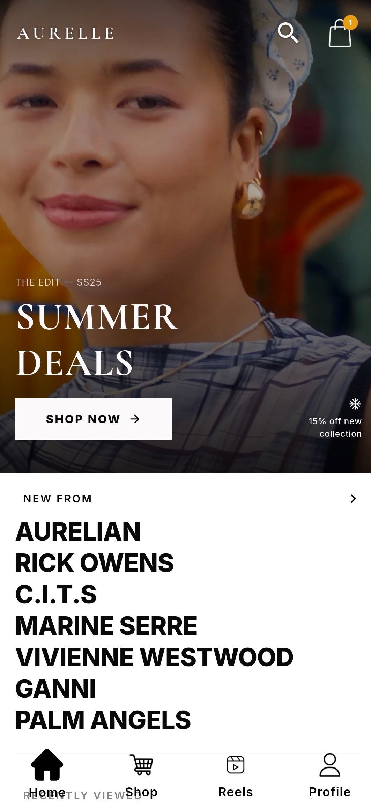
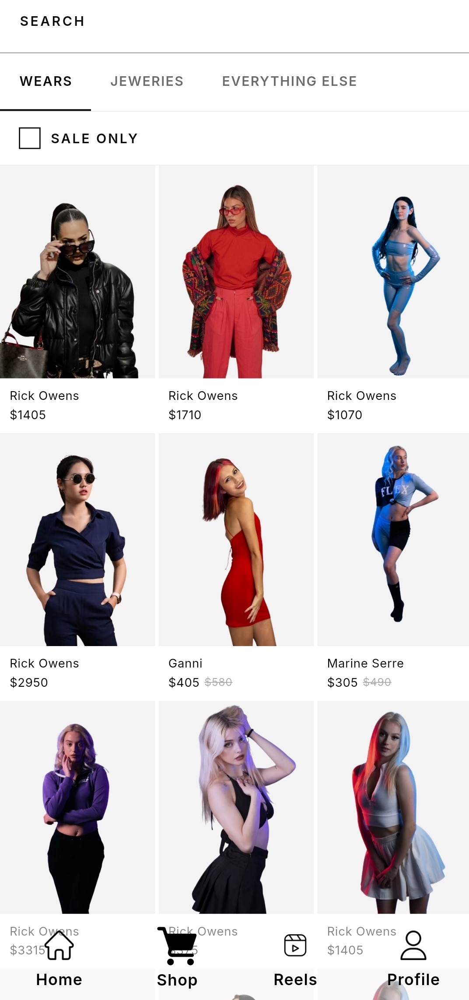
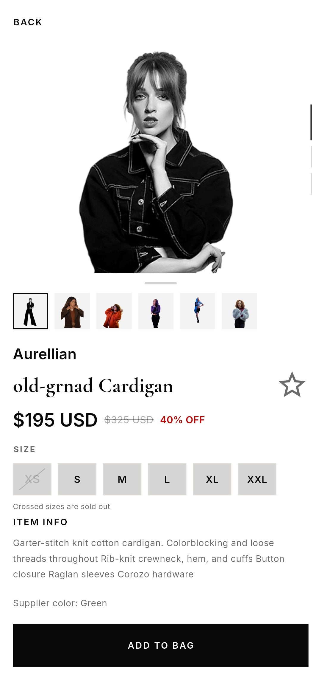
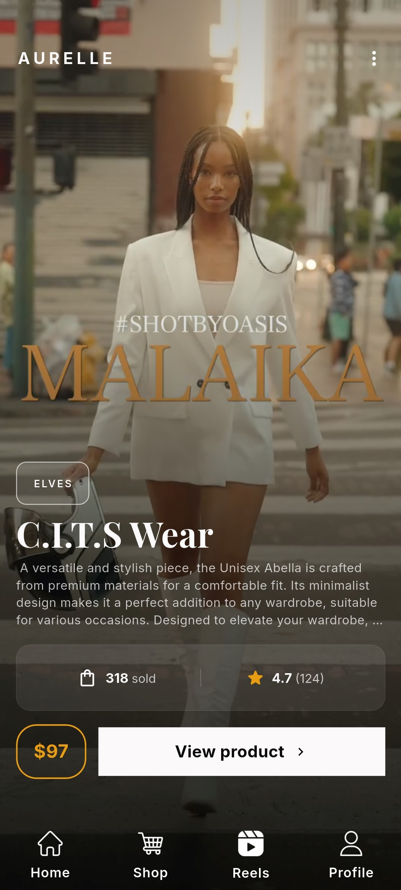
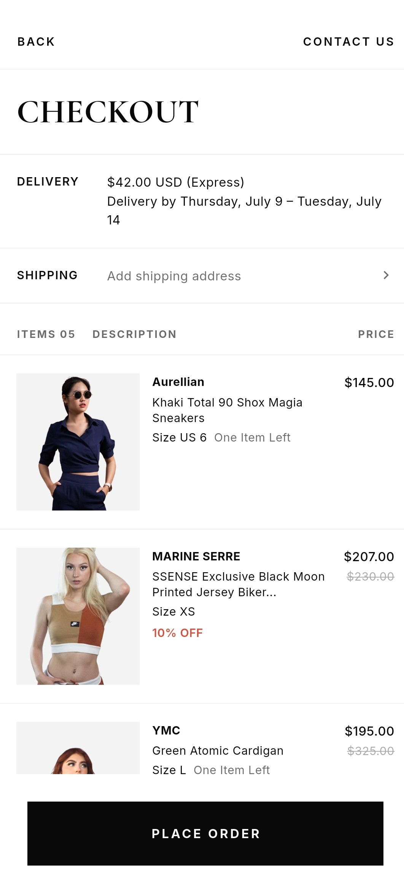

# Aurelle — Luxury Fashion Social Commerce App

A portfolio project reimagining online fashion shopping by merging premium e-commerce with short-form video discovery. Aurelle solves the core problem of online clothing — **what you see is not always what you get** — by letting users watch real model footage before they buy.

---

## ✨ Features

### 🎬 Reels
- Vertical short-form video feed — swipe up/down between reels
- Each reel is linked directly to a shoppable product
- Swipe left from any reel to slide into the full product detail screen
- Minimal overlay card showing brand, name, price, sales count and rating
- Tap the video to hide the overlay for a clean full-screen view
- Like reels when authenticated

### 🛍️ Shopping
- Browse luxury fashion across Womenswear, Menswear and Everything Else
- Full-text product search with live results, suggested searches and recently viewed
- Filter by category, sale status — sort by price or newest
- Full product detail screen with image carousel (front · side · back), variant thumbnail strip, and draggable info sheet
- Tap any product image to collapse the sheet and see the full image
- Add to bag and wishlist from the product screen

### 🏠 Home
- Full-bleed hero video banner with floating nav icons (profile · search · bag)
- Editorial brand list section — SSENSE-style stacked brand names
- Curated product rows (horizontal scroll) and 2-row grids
- Pull to refresh
- Shimmer skeleton loaders while content loads

### 🔍 Search
- Opens with keyboard auto-focused
- Suggested searches (large stacked text — SSENSE style)
- Recently viewed horizontal scroll
- Live 3-column results grid while typing
- Category tabs and SALE ONLY filter within search

### 🏷️ Brands
- Dedicated brand profile pages
- Browse all products by brand
- Follow/unfollow brands (authenticated users)

### 🔐 Authentication
- Google OAuth and Facebook OAuth via Passport.js
- Server-side sessions — no JWT
- Unauthenticated users browse freely — no login wall
- Authentication required only at checkout and profile
- On first login, onboarding preferences synced from device to profile

### 🎯 Personalisation
- Three-step onboarding: Style Identity → Favourite Brands → Discovery Preference
- Preferences saved locally on device (Flutter SharedPreferences) before login
- Preferences passed as query params on public API calls — no login needed:
  ```
  GET /api/products?styles=minimalist,streetwear&brands=Jacquemus,Ganni
  GET /api/reels?styles=old-money
  ```
- On login, preferences synced to MongoDB user profile for persistence

### 🛒 Cart & Checkout
- Add to cart while browsing as a guest
- Cart synced to server after login
- Stripe payment integration
- Order created and confirmed after successful payment
- Order history accessible from profile

---

## 🛠️ Tech Stack

### Frontend

| Layer | Technology |
|---|---|
| Framework | Flutter |
| State Management | Riverpod (`StateNotifier`) |
| Navigation | go_router |
| HTTP Client | Dio |
| Animations | flutter_animate |
| Video Playback | video_player + visibility_detector |
| Responsive Sizing | the_responsive_builder |
| Local Storage | SharedPreferences |
| Fonts | Google Fonts — Playfair Display · Inter · Cormorant Garamond |

### Backend

| Layer | Technology |
|---|---|
| Runtime | Node.js v20 (ES Modules) |
| Framework | Express.js |
| Database | MongoDB Atlas |
| ODM | Mongoose |
| Authentication | Passport.js (Google + Facebook OAuth) |
| Sessions | express-session |
| Media Storage | Cloudinary (images + video CDN) |
| Payments | Stripe |
| Upload Middleware | Multer + multer-storage-cloudinary |
| Security | Helmet · express-rate-limit · CORS |
| Logging | Morgan |

---

## 📁 Project Structure

```
aurelle/
├── aurelle_flutter/                        # Flutter mobile app
│   └── lib/
│       ├── core/
│       │   ├── theme/
│       │   │   ├── app_color.dart          # All app colours — single source of truth
│       │   │   ├── app_theme.dart          # ThemeData configuration
│       │   │   └── app_typography.dart     # Text styles (Playfair, Inter, Cormorant)
│       │   └── navigation/
│       │       ├── app_router.dart         # GoRouter config + ShellRoute
│       │       └── app_routes.dart         # Route path constants
│       ├── features/
│       │   ├── model/
│       │   │   ├── home_model.dart         # HomeState, HeroBannerModel, HomeProductModel
│       │   │   ├── shop_model.dart         # ShopState, ProductVariant, ProductDetailState
│       │   │   ├── reels_model.dart        # ReelModel, ReelProductVariant + adapter
│       │   │   └── search_model.dart       # SearchState, SearchCategory
│       │   ├── provider/
│       │   │   ├── home_provider.dart      # HomeNotifier — home feed state
│       │   │   ├── shop_provider.dart      # ShopNotifier — catalog + filters
│       │   │   ├── reels_provider.dart     # ReelsNotifier + ReelProductDetailNotifier
│       │   │   ├── product_detail_provider.dart  # ProductDetailNotifier (.family)
│       │   │   └── search_provider.dart    # SearchNotifier — query + results
│       │   └── screens/
│       │       ├── homescreen.dart         # Editorial home feed
│       │       ├── shop_screen.dart        # Category tabs, grid, sort/filter bar
│       │       ├── reels_screen.dart       # Vertical + horizontal PageView architecture
│       │       ├── product_detail_screen.dart  # Carousel + DraggableScrollableSheet
│       │       ├── search_screen.dart      # Live search + suggestions
│       │       └── onboarding.dart         # 3-step onboarding flow
│       ├── shared/
│       │   └── widget/
│       │       ├── Home/
│       │       │   ├── hero_banner.dart            # Full-bleed video banner + floating UI
│       │       │   ├── brand_list_section.dart     # Stacked brand name rows
│       │       │   ├── product_row_section.dart    # Horizontal scroll + 2-row grid
│       │       │   └── recently_viewed_section.dart
│       │       ├── reels/
│       │       │   └── reels_overlay.dart          # Brand pill + name + stats + CTAs
│       │       └── Onboarding/
│       │           ├── Image_card.dart             # Style/discovery selection card
│       │           ├── brand_tile.dart             # Brand logo selection tile
│       │           ├── onboarding_bottombar.dart   # Counter pill + CTA button
│       │           └── progress_indicator.dart     # Gold segmented progress bar
│       └── config/
│           └── appshell.dart               # Persistent shell + 4-item bottom nav
│
└── aurelle_backend/                        # Node.js REST API
    ├── server.js                           # Entry point — HTTP server boot
    ├── package.json
    ├── .env.example
    └── src/
        ├── app.js                          # Express app — middleware + routes
        ├── config/
        │   ├── db.js                       # MongoDB Atlas connection
        │   ├── passport.js                 # Google + Facebook OAuth strategies
        │   └── seed.js                     # Database seeder (brands, products, reels)
        ├── middleware/
        │   ├── auth.js                     # protect() — session guard
        │   └── validate.js                 # express-validator error handler
        └── modules/
            ├── auth/                       # OAuth routes + preference sync + logout
            ├── users/                      # User model + profile update
            ├── products/                   # Catalog, search, category filter
            ├── reels/                      # Feed, single reel, like/unlike
            ├── brands/                     # Brand profiles, follow/unfollow
            ├── cart/                       # Add, update, remove, clear
            └── orders/                     # Create order, history, detail
```

---

## 🚀 Getting Started

### Prerequisites

- Flutter SDK `>=3.0.0`
- Node.js `>=20.0.0`
- MongoDB Atlas account (free tier)
- Cloudinary account (free tier)
- Google Cloud Console project (for OAuth)
- Facebook Developer account (for OAuth)
- Stripe account (test mode)

---

### Backend Setup

**1. Navigate to the backend folder**
```bash
cd aurelle_backend
```

**2. Install dependencies**
```bash
npm install
```

**3. Configure environment**
```bash
cp .env.example .env
```
Fill in all values — see [Environment Variables](#-environment-variables) below.

**4. Seed the database**
```bash
npm run seed
```

**5. Start the server**
```bash
# Development — auto-restarts on file change
npm run dev

# Production
npm start
```

**6. Verify it's running**
```bash
curl http://localhost:5000/health
# → { "success": true, "message": "Aurelle API is running 🚀" }
```

---

### Flutter Setup

**1. Navigate to the Flutter project**
```bash
cd aurelle_flutter
```

**2. Install packages**
```bash
flutter pub get
```

**3. Point to your backend**

Update the base URL in your Dio client:
```dart
// lib/core/network/api_client.dart
static const String baseUrl = 'http://localhost:5000/api';
```
When testing on a physical device, use your machine's local IP address instead of `localhost`.

**4. Run the app**
```bash
flutter run
```

---

## 🔑 Environment Variables

Create a `.env` file inside `aurelle_backend/` using `.env.example` as a template:

```env
# ── Server ─────────────────────────────────────────────────────────────────
PORT=5000
NODE_ENV=development

# ── MongoDB Atlas ───────────────────────────────────────────────────────────
# atlas.mongodb.com → Connect → Drivers
MONGO_URI=mongodb+srv://<user>:<password>@cluster0.xxxxx.mongodb.net/aurelle

# ── Google OAuth ────────────────────────────────────────────────────────────
# console.cloud.google.com → APIs & Services → Credentials
GOOGLE_CLIENT_ID=your_google_client_id
GOOGLE_CLIENT_SECRET=your_google_client_secret
GOOGLE_CALLBACK_URL=http://localhost:5000/api/auth/google/callback

# ── Facebook OAuth ──────────────────────────────────────────────────────────
# developers.facebook.com → Your App → Settings → Basic
FACEBOOK_APP_ID=your_facebook_app_id
FACEBOOK_APP_SECRET=your_facebook_app_secret
FACEBOOK_CALLBACK_URL=http://localhost:5000/api/auth/facebook/callback

# ── Cloudinary ──────────────────────────────────────────────────────────────
# cloudinary.com → Dashboard
CLOUDINARY_CLOUD_NAME=your_cloud_name
CLOUDINARY_API_KEY=your_api_key
CLOUDINARY_API_SECRET=your_api_secret

# ── Stripe ──────────────────────────────────────────────────────────────────
# dashboard.stripe.com → Developers → API Keys
STRIPE_SECRET_KEY=sk_test_xxxxxxxxxxxx
STRIPE_WEBHOOK_SECRET=whsec_xxxxxxxxxxxx

# ── Session ─────────────────────────────────────────────────────────────────
SESSION_SECRET=a_long_random_string_at_least_32_characters

# ── Client ──────────────────────────────────────────────────────────────────
CLIENT_URL=http://localhost:3000
```

**Generate secure random strings:**
```bash
node -e "console.log(require('crypto').randomBytes(32).toString('hex'))"
```

---

## 🌐 API Reference

### Auth
| Method | Endpoint | Access | Description |
|--------|----------|--------|-------------|
| GET | `/api/auth/google` | Public | Start Google OAuth flow |
| GET | `/api/auth/google/callback` | Public | Google OAuth callback |
| GET | `/api/auth/facebook` | Public | Start Facebook OAuth flow |
| GET | `/api/auth/facebook/callback` | Public | Facebook OAuth callback |
| GET | `/api/auth/me` | 🔒 Protected | Get logged-in user |
| POST | `/api/auth/preferences` | 🔒 Protected | Sync onboarding preferences |
| POST | `/api/auth/logout` | 🔒 Protected | Destroy session |

### Products
| Method | Endpoint | Access | Description |
|--------|----------|--------|-------------|
| GET | `/api/products` | Public | All products — filter + paginate |
| GET | `/api/products/search?q=` | Public | Full-text search |
| GET | `/api/products/:id` | Public | Single product detail |

**Supported query params:**
```
category  = womenswear | menswear | everythingElse
saleOnly  = true
brands    = Jacquemus,Ganni           ← preference filter
styles    = minimalist,streetwear     ← preference filter
sort      = price_asc | price_desc | newest
page      = 1
limit     = 20
```

### Reels
| Method | Endpoint | Access | Description |
|--------|----------|--------|-------------|
| GET | `/api/reels` | Public | Chronological feed |
| GET | `/api/reels/:id` | Public | Single reel |
| POST | `/api/reels/:id/like` | 🔒 Protected | Like a reel |
| DELETE | `/api/reels/:id/like` | 🔒 Protected | Unlike a reel |

### Brands
| Method | Endpoint | Access | Description |
|--------|----------|--------|-------------|
| GET | `/api/brands` | Public | All brand profiles |
| GET | `/api/brands/:slug` | Public | Brand profile + products |
| POST | `/api/brands/:id/follow` | 🔒 Protected | Follow a brand |
| DELETE | `/api/brands/:id/follow` | 🔒 Protected | Unfollow a brand |

### Cart
| Method | Endpoint | Access | Description |
|--------|----------|--------|-------------|
| GET | `/api/cart` | 🔒 Protected | Get user's cart |
| POST | `/api/cart/items` | 🔒 Protected | Add item |
| PUT | `/api/cart/items/:productId` | 🔒 Protected | Update quantity |
| DELETE | `/api/cart/items/:productId` | 🔒 Protected | Remove item |
| DELETE | `/api/cart` | 🔒 Protected | Clear cart |

### Orders
| Method | Endpoint | Access | Description |
|--------|----------|--------|-------------|
| GET | `/api/orders` | 🔒 Protected | Order history |
| GET | `/api/orders/:id` | 🔒 Protected | Single order detail |
| POST | `/api/orders` | 🔒 Protected | Create order after payment |

---

## 🔐 Authentication Flow

```
Flutter opens Google/Facebook login URL in WebView
  └─ User approves on OAuth provider screen
       └─ Provider redirects to /api/auth/google/callback
            └─ Passport.js finds or creates user in MongoDB
                 └─ Session created → cookie sent to Flutter
                      └─ Flutter calls GET /api/auth/me
                           └─ First login?
                                ├─ YES → POST /api/auth/preferences
                                │         (syncs onboarding prefs from device)
                                └─ NO  → User already has preferences
```

**Key design decision:** Users browse freely without logging in. The login wall only appears at checkout and profile. Preferences work without auth via query params.

---

## 🎬 Reels Architecture

Each reel entry uses a nested `PageView` — vertical for the feed, horizontal for product detail:

```
Vertical PageView       (swipe up/down = next/prev reel)
  └─ _ReelEntry
       └─ Horizontal PageView
            ├─ Page 0: _ReelVideoPage
            │    ├─ Full-screen video
            │    ├─ Dark gradient overlay
            │    ├─ AURELLE top bar
            │    └─ ReelsOverlay
            │         ├─ Brand pill
            │         ├─ Product name (Playfair Display)
            │         ├─ Short description
            │         ├─ Stats bar (sold | rating)
            │         └─ Price pill + View Product button
            └─ Page 1: ProductDetailScreen
                 └─ Fed via ProviderScope override
                    from ReelModel data — no new screen created
```

---

## 🖼️ Media Storage

All media is hosted on Cloudinary with this folder convention:

```
aurelle/
└── brands/
    └── {brand-slug}/
        ├── logo.png
        ├── {product-slug}/
        │   ├── front.jpg          ← model facing front
        │   ├── side.jpg           ← model facing sideways
        │   └── back.jpg           ← model facing back
        └── {product-slug}-reel.mp4   ← optional reel video
```

**Example URLs:**
```
Logo:   https://res.cloudinary.com/{cloud}/image/upload/aurelle/brands/jacquemus/logo.png
Image:  https://res.cloudinary.com/{cloud}/image/upload/aurelle/brands/jacquemus/santon-dress/front.jpg
Reel:   https://res.cloudinary.com/{cloud}/video/upload/aurelle/brands/jacquemus/santon-dress-reel.mp4
```

Not every product needs a reel. Products without a reel simply have no entry in the Reels collection.

---

## 🗃️ Database Models

### User
| Field | Type | Description |
|---|---|---|
| name | String | Display name |
| email | String | Unique, lowercased |
| googleId | String | Null if not connected |
| avatar | String | Profile photo URL |
| preferences.styles | [String] | Onboarding style picks |
| preferences.brands | [String] | Onboarding brand picks |
| preferences.discovery | [String] | Onboarding discovery picks |
| followedBrands | [ObjectId] | Refs to Brand |
| onboardingComplete | Boolean | True after first preference sync |


### Product
| Field | Type | Description |
|---|---|---|
| name | String | Product name |
| brand | ObjectId | Ref to Brand |
| price | Number | Current price |
| originalPrice | Number | Null = not on sale |
| category | String | womenswear · menswear · everythingElse |
| sizes | [{ label, isSoldOut }] | Size options |
| variants | [{ color, images, stock }] | Colour variants |
| tags | [String] | Used for preference filtering |
| isOnSale | Virtual | true if originalPrice > price |
| salePercent | Virtual | Calculated discount % |

### Reel
| Field | Type | Description |
|---|---|---|
| product | ObjectId | Ref to Product |
| videoUrl | String | Cloudinary video URL |
| thumbnailUrl | String | First frame thumbnail |
| likes | Number | Total like count |
| salesCount | Number | Auto-incremented on order |
| rating | Number | 0–5 |
| reviewCount | Number | Number of reviews |
| likedBy | [ObjectId] | Prevents double-liking |

---

## 🌱 Database Seeding

The seed script populates 7 brands, 17 products and 3 reels.

**Before running — replace the cloud name:**
```js
// src/config/seed.js — line 9
const CDN = 'https://res.cloudinary.com/YOUR_CLOUD_NAME/image/upload/aurelle/brands';
```

**Run:**
```bash
npm run seed
```

**Output:**
```
✅ Connected to MongoDB
🗑️  Cleared existing data
✅ Seeded 7 brands
✅ Seeded 17 products
✅ Seeded 3 reels
🎉 Done!
```


## 🏗️ Milestones

| # | Milestone | Status |
|---|-----------|--------|
| 1 | Project scaffold — server, DB connection, middleware | ✅ Complete |
| 2 | Database models — User, Product, Brand, Reel, Cart, Order | ✅ Complete |
| 3 | Authentication — Google + Facebook OAuth, sessions | ✅ Complete |
| 4 | Public routes — products, reels, brands + preference filtering | ✅ Complete |
| 5 | Cloudinary setup + database seeding | ✅ Complete |
| 6 | Cart — add, update, remove, sync after login | 🔄 In Progress |
| 7 | Checkout + Stripe + order creation | ⏳ Upcoming |
| 8 | Flutter ↔ API integration (Dio) | ⏳ Upcoming |

---

## 📱 App Screens

| Screen | Description |
|--------|-------------|
| Splash | Aurelle logo with loading indicator |
| Onboarding Step 1 | Style Identity — pick 2–3 aesthetics |
| Onboarding Step 2 | Favourite Brands — searchable brand grid |
| Onboarding Step 3 | Discovery Preference — pick 1–2 modes |
| Home | Full-bleed hero video, floating icons, brand list, curated rows |
| Shop | Category tabs, SALE ONLY filter, 3-column grid, SORT BY / FILTERS bar |
| Product Detail | Full-screen carousel, variant thumbnails, draggable info sheet |
| Reels | Vertical video feed — swipe left to product detail |
| Search | Suggested searches, recently viewed, live results grid |
| Profile | User info, order history, followed brands |

---


## 📱 Screenshots
 

| Home | Shop | Product | Reel | cart |
|---|---|---|---|---|
|  |  |  |  |  |
 
---
---


## 🤝 Contributing

1. Fork the repository
2. Create your feature branch — `git checkout -b feature/your-feature`
3. Commit your changes — `git commit -m 'Add your feature'`
4. Push to the branch — `git push origin feature/your-feature`
5. Open a Pull Request

---

## 📄 License

This project is licensed under the MIT License — see the [LICENSE](LICENSE) file for details.

---

## 🙏 Acknowledgements

- [Flutter](https://flutter.dev) — Cross-platform UI framework
- [Riverpod](https://riverpod.dev) — State management
- [go_router](https://pub.dev/packages/go_router) — Navigation
- [Cloudinary](https://cloudinary.com) — Media storage and CDN
- [MongoDB Atlas](https://www.mongodb.com/atlas) — Cloud database
- [Passport.js](https://www.passportjs.org) — OAuth strategies
- [Stripe](https://stripe.com) — Payment processing
- [flutter_animate](https://pub.dev/packages/flutter_animate) — Animations
- [SSENSE](https://www.ssense.com) — Design inspiration

---

> *Aurelle — where fashion discovery meets confident shopping.*